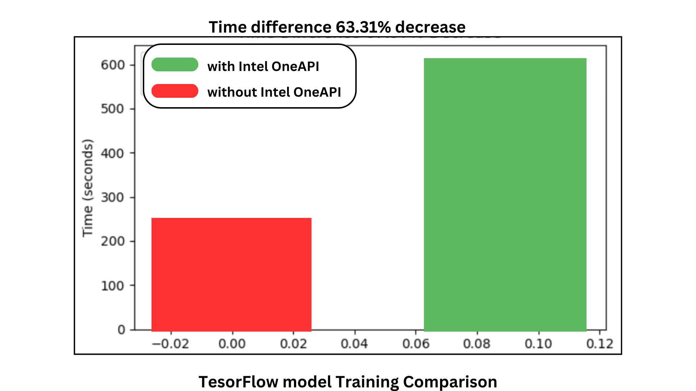

# Break the Silence: Empowering Communication with Real-Time Sign Language  Translator 🧏🏻 

Imagine a world where sign language and spoken language seamlessly connect  🤝.
This AI-powered app bridges the gap for deaf and hard-of-hearing individuals (♂️♀️), empowering them to:

 1) **Chat freely:** Real-time translation lets conversations flow naturally .
 2) **Unlock opportunities:** Boost participation in education, employment, and healthcare .
3) **Feel included:** Connect with others and break down communication barriers .

# Flow Diagram 

# Usage of Intel Developer Cloud 🌐💻

Intel DevCloud Accelerates Sign Language Gesture Translator Development
Our Sign Language Gesture Translator project benefited tremendously from the resources offered by Intel Developer Cloud.  Leveraging Intel's CPU and XPU processing power, combined with the oneAPI toolkit, significantly sped up two critical aspects: Sign Language Gesture Recognition and Real-Time Translation.

**1) Faster Gesture Recognition Model Training:**

**Reduced Training Time:** Intel DevCloud's CPU and XPU capabilities, coupled with oneAPI, dramatically reduced our Sign Language Gesture Recognition model training time.  The high-performance computing infrastructure enabled efficient training, allowing for faster model optimization and experimentation.

**oneAPI Optimization:**  This open-source toolkit played a key role by optimizing the computational tasks involved in training.  By leveraging oneAPI, we achieved significant speedups compared to traditional training environments.

**2) Real-Time Translation Acceleration:**

**Hardware Acceleration:**  Intel DevCloud's hardware resources facilitated real-time translation capabilities.  The powerful CPUs and XPUs, combined with oneAPI optimizations, enabled efficient processing of video frames, ensuring smooth and lag-free translation.

**Reduced Latency:**  By optimizing the model for Intel hardware, we minimized latency during real-time translation. This allows for near-instantaneous conversion of sign language gestures into spoken words or text, enhancing user experience.

Overall, Intel DevCloud played a critical role in accelerating our Sign Language Gesture Translator development.  The combination of powerful hardware, optimized software tools (oneAPI), and a scalable cloud environment enabled us to achieve faster training times, reduced latency, and ultimately, a more efficient and effective translation system.

>Comparison between time took in Intel Developers Cloud using OneDNN and Google Colab
    
In summary, Intel Developer Cloud's advanced CPU and XPU technologies provided us with the computational power necessary to expedite model training and inference processes, ultimately accelerating our project development and deployment timelines. 🚀🕒

<h2 align=center>Role of oneAPI DNN</h2>
In this project we used large amount of dataset so normally it's take long time process.

I choosed OneAPI DNN it's have optimized library and Python OneAPI kernal. So, it's give acceleration my project and gives high accuracy output. 

  

<h2 align=center>oneAPI Deep Neural Network Library (oneDNN)</h2>
oneAPI Deep Neural Network Library (oneDNN) is an open-source cross-platform
performance library of basic building blocks for deep learning applications.
oneDNN is part of [oneAPI](https://oneapi.io).
The library is optimized for Intel(R) Architecture Processors, Intel Graphics,
and Arm\* 64-bit Architecture (AArch64)-based processors. oneDNN has
experimental support for the following architectures: NVIDIA\* GPU,
AMD\* GPU, OpenPOWER\* Power ISA (PPC64), IBMz\* (s390x), and RISC-V.

oneDNN is intended for deep learning applications and framework
developers interested in improving application performance
on Intel CPUs and GPUs. Deep learning practitioners should use one of the
[applications enabled with oneDNN](#applications-enabled-with-onednn).
