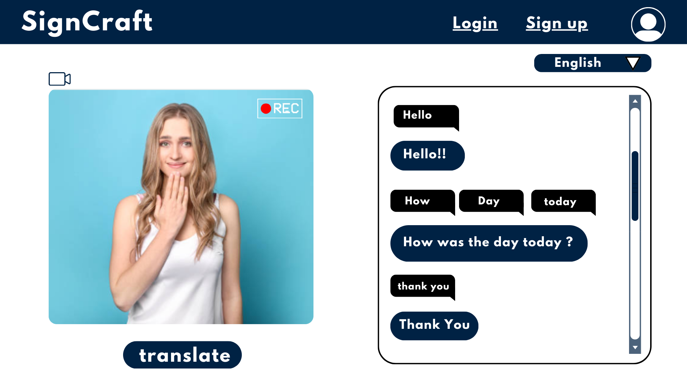
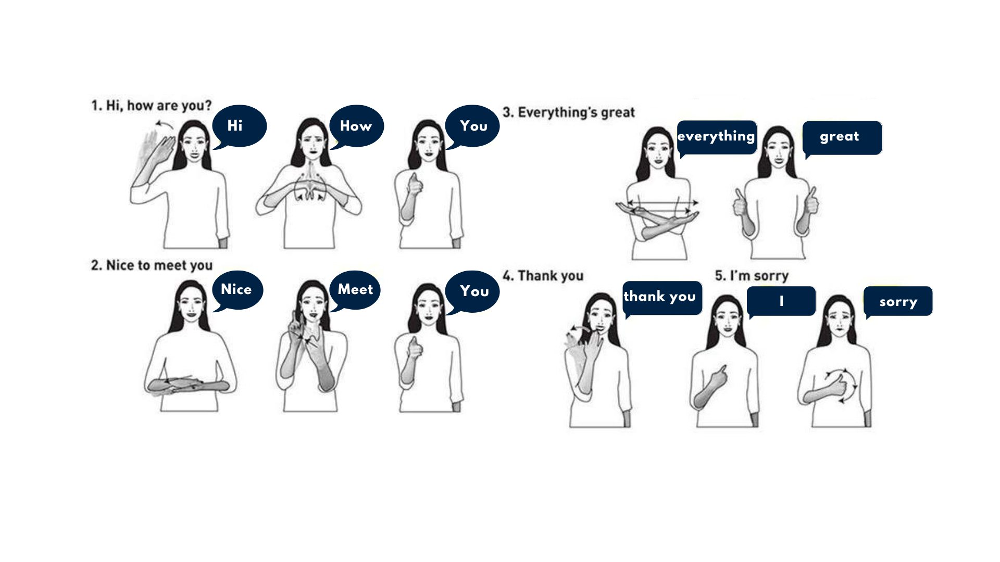
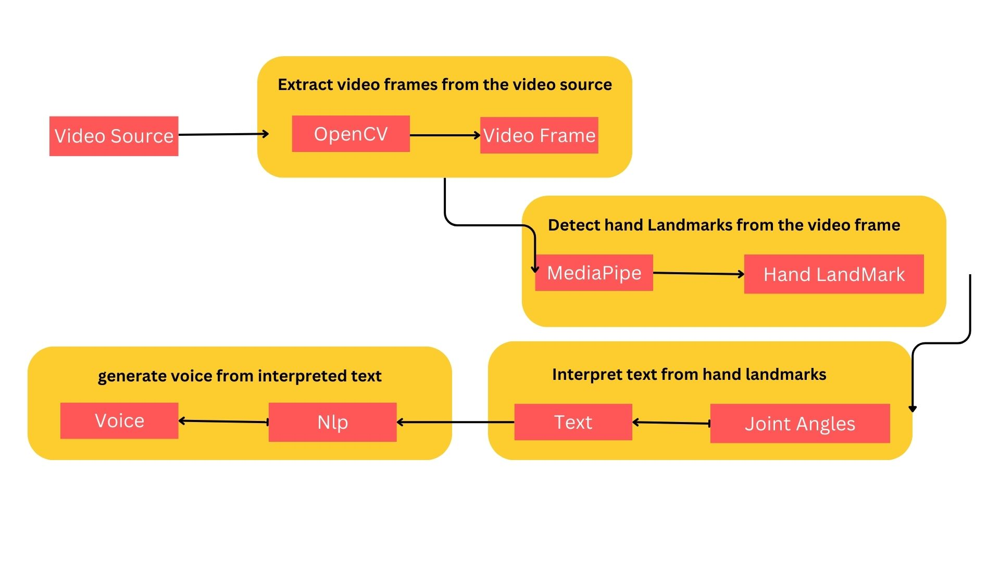

# Break the Silence: Empowering Communication with Real-Time Sign Language  Translator 🧏🏻 

Imagine a world where sign language and spoken language seamlessly connect  🤝.
This AI-powered app bridges the gap for deaf and hard-of-hearing individuals (♂️♀️), empowering them to:

 1) **Chat freely:** Real-time translation lets conversations flow naturally .
 2) **Unlock opportunities:** Boost participation in education, employment, and healthcare .
 3) **Feel included:** Connect with others and break down communication barriers .

# Demo

# MediaPipe for detection

MediaPipe is an open-source framework developed by Google for building real-time multi-modal processing pipelines. It offers pre-built building blocks for common computer vision and machine learning tasks, including hand landmark detection. This makes it a user-friendly and efficient tool for developers to create applications that interact with the physical world through gestures.

 **Keypoint Detection and Tracking**

 In the context of hand gesture recognition, MediaPipe's hand landmarking model performs two crucial functions:
 
 **Keypoint Detection:** The model identifies specific points of interest on the hand, such as the tip of each finger, the base of the palm, and wrist. These points are 
 crucial  for understanding hand posture and movement. MediaPipe's model detects 21 of these keypoints with high accuracy.
 
 **Tracking:** Once the keypoints are identified in a frame, MediaPipe can track them across subsequent video frames. This allows the system to understand the motion and  trajectory of the hand, making it possible to recognize gestures that involve movement over time.

**Benefits of Using MediaPipe***

 Here's why MediaPipe is a popular choice for hand gesture recognition tasks:
 
 **Pre-built and efficient:** MediaPipe provides a pre-trained hand landmarking model, saving developers the time and effort of training a model from scratch. This makes it 
 ideal for rapid prototyping and development.
 Cross-platform: MediaPipe works across various platforms, including mobile, desktop, and web. This allows developers to build applications that can run on a wide range of 
 devices.
 **Real-time performance:** The framework is optimized for real-time processing, making it suitable for applications that require low latency, like gesture-based interfaces 
 or sign language recognition.
 **Customizable:** While MediaPipe offers pre-built solutions, it also allows for customization. Developers can fine-tune the model or integrate it with other modules to 
 create more complex applications.

 

# Word_to_Sentence model 
 Recognizing the sequence of signs and generating grammatically correct text that reflects the intended meaning.Disambiguation techniques handle signs with multiple 
 meanings based on context. The translated text appears on screen in real-time, fostering a natural flow of conversation.

# Flow Diagram 

**1) Extract video frames from the video source:**
                The first step involves breaking down the video into individual images, each representing a single frame captured at a specific point in time. This is typically done using computer vision libraries like OpenCV.

**2) Detect hand landmarks from the video frame:** 
                Here, a machine learning model, such as MediaPipe’s hand landmarking model, comes into play. This model analyzes each frame and identifies the location of key points on the hand, like the tip of the thumb, base of the palm, and fingertips. These key points are represented as landmarks.

**3)Interpret text from hand landmarks:** 
                Once the hand landmarks are identified, the system can interpret the hand pose to potentially generate text. The specific meaning assigned to a hand pose depends on the context and the application. For instance, in sign language recognition, a specific combination of hand landmark locations could correspond to a particular letter or word.

**4)Generate voice from interpreted text:** 
               The final step involves converting the interpreted text into spoken language using a text-to-speech synthesis model. This would allow for a real-time hand gesture to speech conversion system.

               

# Usage of Intel Developer Cloud 🌐💻

Intel DevCloud Accelerates Sign Language Gesture Translator Development
Our Sign Language Gesture Translator project benefited tremendously from the resources offered by Intel Developer Cloud.  Leveraging Intel's CPU and XPU processing power, combined with the oneAPI toolkit, significantly sped up two critical aspects: Sign Language Gesture Recognition and Real-Time Translation.

**1) Faster Gesture Recognition Model Training:**

**Reduced Training Time:** Intel DevCloud's CPU and XPU capabilities, coupled with oneAPI, dramatically reduced our Sign Language Gesture Recognition model training time.  The high-performance computing infrastructure enabled efficient training, allowing for faster model optimization and experimentation.

**oneAPI Optimization:**  This open-source toolkit played a key role by optimizing the computational tasks involved in training.  By leveraging oneAPI, we achieved significant speedups compared to traditional training environments.

**2) Real-Time Translation Acceleration:**

**Hardware Acceleration:**  Intel DevCloud's hardware resources facilitated real-time translation capabilities.  The powerful CPUs and XPUs, combined with oneAPI optimizations, enabled efficient processing of video frames, ensuring smooth and lag-free translation.

**Reduced Latency:**  By optimizing the model for Intel hardware, we minimized latency during real-time translation. This allows for near-instantaneous conversion of sign language gestures into spoken words or text, enhancing user experience.

Overall, Intel DevCloud played a critical role in accelerating our Sign Language Gesture Translator development.  The combination of powerful hardware, optimized software tools (oneAPI), and a scalable cloud environment enabled us to achieve faster training times, reduced latency, and ultimately, a more efficient and effective translation system.

>Comparison between time took in Intel Developers Cloud using OneDNN and Google Colab
    
In summary, Intel Developer Cloud's advanced CPU and XPU technologies provided us with the computational power necessary to expedite model training and inference processes, ultimately accelerating our project development and deployment timelines. 🚀🕒

<h2 align=center>Role of oneAPI DNN</h2>
In this project we used large amount of dataset so normally it's take long time process.

I choosed OneAPI DNN it's have optimized library and Python OneAPI kernal. So, it's give acceleration my project and gives high accuracy output. 

  

<h2 align=center>oneAPI Deep Neural Network Library (oneDNN)</h2>
oneAPI Deep Neural Network Library (oneDNN) is an open-source cross-platform
performance library of basic building blocks for deep learning applications.
oneDNN is part of [oneAPI](https://oneapi.io).
The library is optimized for Intel(R) Architecture Processors, Intel Graphics,
and Arm\* 64-bit Architecture (AArch64)-based processors. oneDNN has
experimental support for the following architectures: NVIDIA\* GPU,
AMD\* GPU, OpenPOWER\* Power ISA (PPC64), IBMz\* (s390x), and RISC-V.

oneDNN is intended for deep learning applications and framework
developers interested in improving application performance
on Intel CPUs and GPUs. Deep learning practitioners should use one of the
[applications enabled with oneDNN](#applications-enabled-with-onednn).
